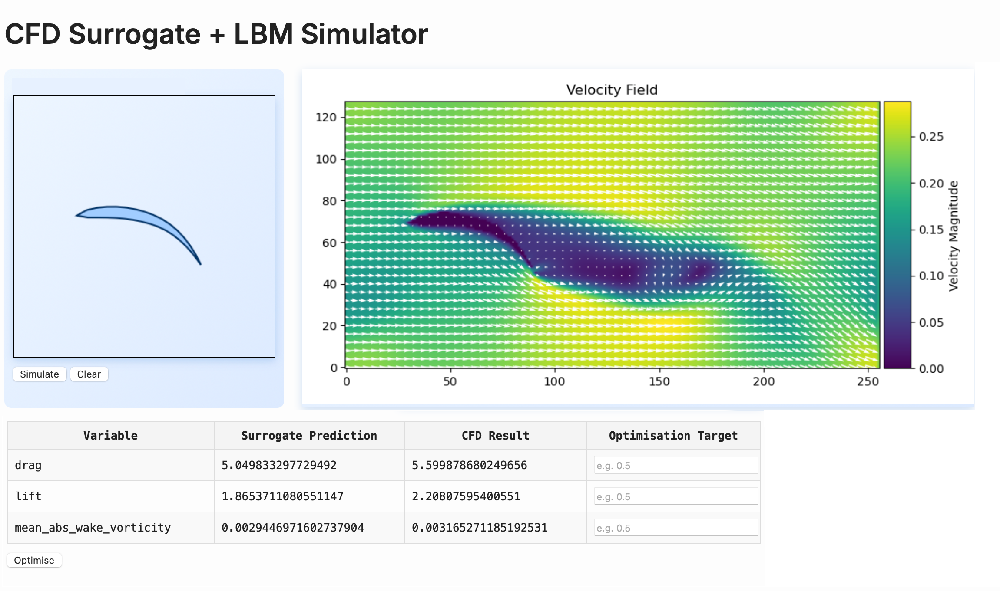
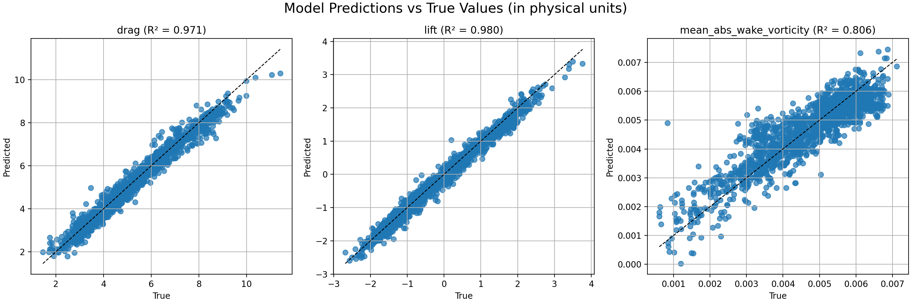

# GNN-Based CFD Surrogate with LBM Simulator

This project demonstrates a lightweight, self-contained system for **learning and optimizing CFD flow metrics** using a **Graph Neural Network (GNN)** surrogate model trained on **Lattice Boltzmann Method (LBM)** simulations.

The system supports both **live simulation** using the LBM and **real-time prediction** via a trained GNN, with an integrated optimization loop to explore geometry-performance trade-offs.

## Key Features

- **GNN surrogate model** trained to predict drag, lift, and mean wake vorticity for 2D shapes
- **LBM simulation engine** for generating ground truth velocity fields
- **Integrated UI** for drawing shapes, visualizing flow fields, and running optimization
- **Model vs simulation comparison** to assess surrogate accuracy
- **Optimization loop** that adjusts shape to target performance metrics
- **FastAPI + responsive interface** for real-time interactivity



## LBM Animation

A sample animation for a randomly generated polygon.


## GNN inference performance

The trained surrogate's OOS r-squared across three target metrics.



## Technologies Used

- PyTorch Geometric (GNN training)
- NumPy / Matplotlib (geometry and plotting)
- Custom LBM solver (2D CFD on a regular grid)
- FastAPI (interactive UI)
- MLFlow (optional experiment tracking)
- Docker (optional containerization)

## How It Works

1. User draws or loads a 2D shape.
2. The surrogate model predicts drag, lift, and wake metrics instantly.
3. The shape is passed to the LBM solver for simulation and comparison.
4. User can then specify optimisation targets.
5. An optimization loop adjusts geometry to minimize drag or wake vorticity.
6. All steps are visualized with velocity fields and numerical outputs.

## Motivation

This project reflects my interest in **bringing machine learning to bear on physical systems**—especially in areas like simulation acceleration, surrogate modeling, and closed-loop optimization. It draws inspiration from work at leading scientific AI/ML companies, and showcases what can be done at small scale with suitable integration of classical and modern techniques.

## Future Directions

- Active learning loop to retrain the surrogate on uncertain samples (using MC dropout at inference time for uncertainty quantification)
- Extension to 3D shapes and more complex fluid domains
- Integration with physics-informed loss functions and architectures (e.g., FNO to capture the full flow field)
- Unit tests: for any kind of production use these are not optional!
- Model checkpointing and training resumption
- Bridge to production: set up CI/CD, integrate with cloud experiment tracking beyond local MLFlow, container orchestration e.g., using kubernetes, and monitoring

## How to use

Assuming dependencies are satisfied, there are two main avenues:

1. CLI tools, used for generating training data, training the model, and visualising inference performance and LBM simulations
2. Web UI, using FastAPI to work interactively with trained surrogates

### CLI tools

These are all accessed by passing flags to ```python main.py```, see ```python main.py --help```.

A minimal workflow involves generating training data (with ```--generate-training-data```) and then fitting a GNN (with or without hyperparameter optimisation) using ```--train-gnn```.

Once these tasks are complete, it will be possible to launch the web UI to perform inference using the trained surrogate. E.g., ```uvicorn main:app --reload --port 8001```.


## License

MIT License
